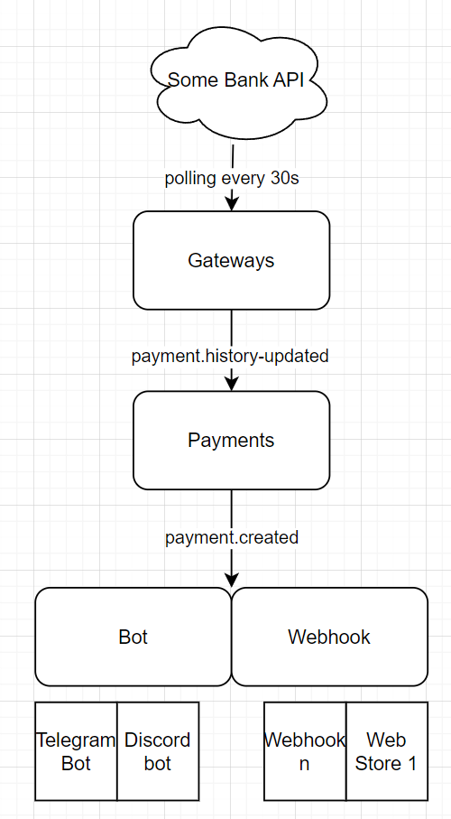

# Payment service

# Mục đích

- Free 100%

- Open source, self host, sử dụng api gốc của ngân hàng.

- Bảo mật thông tin giao dịch và thông tin đăng nhập ngân hàng.

- Thông báo qua telegram, discord.

- Gửi webhook để các service khác cộng số dư cho user.

- API danh sách giao dịch.

- Không giới hạn số lượng giao dịch.

- Cài đặt đơn giản: sửa file config, chạy lệnh docker-compose up.

- Source có khả năng thêm các cổng thanh toán tuỳ chỉnh dễ dàng.

- Sử dụng bullmq đảm bảo webhook, thông báo được gửi đi.

# Next ?

- Database
- Auth
- Ví điện tử



# Cài đặt

## Tạo file config/config.yml

- Xem ví dụ tại config/config.example.yml
- HD: https://wfb4kugxtf8.sg.larksuite.com/docx/Q5YxdjGg0omawaxkGiElo4mhgnb

## Khởi chạy với docker

```
docker-compose -f docker-compose.prod.yml up -d
```

## Mở rộng

- Thêm bất cứ loại giao dịch hay cổng thanh toán nào, emit event `payment.history-updated`
- Lắng nghe có giao dịch mới, `@OnEvent("payment.created")`

## Hướng dẫn thêm cổng thanh toán

- Tạo thêm file mới `/gateways/gateway-factory/yourgateway.services.ts`

```ts
import { GateType, Payment } from '../gate.interface';
import { Gate } from '../gates.services';

export class YourGatewayService extends Gate {
  async getHistory(): Promise<Payment[]> {
    // your code here
    return ...
  }
}
```

- Sửa `GateType` (nếu cần)
- Cập nhật `GateFactory`

## Hướng dẫn tích hợp bot Telegram

## Hướng dẫn tích hợp bot Discord

# Bản quyền

- Mã nguồn của dịch vụ này được công khai, cho phép bất kỳ ai xem, sửa đổi, và cải thiện nó.
- Được phép sử dụng vào mục đích thương mại: tạo cổng thanh toán cho website, thông báo giao dịch cho nhân viện của hàng,...
- Không sử dụng thương mại: mở các dịch vụ tương tự Casso.vn

# Miễn trừ trách nhiệm

- **Miễn Trừ Trách Nhiệm Pháp Lý**: Người phát triển mã nguồn không chịu trách nhiệm pháp lý cho bất kỳ thiệt hại hay tổn thất nào xuất phát từ việc sử dụng hoặc không thể sử dụng dịch vụ.

- **Sử Dụng API Ngân Hàng Không Chính Thức**: Dịch vụ này hiện đang sử dụng các API của ngân hàng mà không có sự đồng ý chính thức từ các ngân hàng hoặc tổ chức tài chính liên quan. Do đó, người sáng lập và nhóm phát triển:
  - Không chịu trách nhiệm cho bất kỳ vấn đề pháp lý hoặc hậu quả nào phát sinh từ việc sử dụng các API này.
  - Không đảm bảo tính chính xác, độ tin cậy, hoặc tính sẵn có của dữ liệu lấy từ các API này.
  - Khuyến cáo người dùng cần cân nhắc rủi ro pháp lý và an toàn thông tin khi sử dụng dịch vụ.

**Ghi Chú Quan Trọng:**

- Việc sử dụng các API không chính thức này có thể vi phạm các quy định pháp lý và chính sách của ngân hàng.
- Chúng tôi khuyến khích người dùng và các bên liên quan cân nhắc kỹ lưỡng trước khi sử dụng dịch vụ này cho các mục đích tài chính hoặc thanh toán quan trọng.
- Người dùng nên tham khảo ý kiến từ chuyên gia pháp lý hoặc tài chính trước khi đưa ra quyết định dựa trên dữ liệu hoặc dịch vụ được cung cấp qua dịch vụ này.
